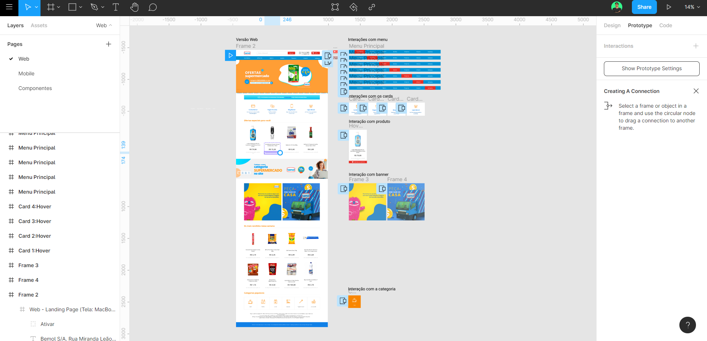
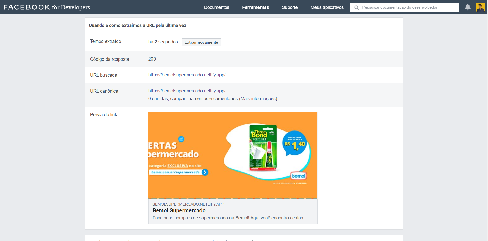

<p align="center">
<a href="https://nodejs.org/en/"></a>
<a href="https://github.com/twbs/bootstrap"></a>
<a href="https://github.com/BrowserSync/browser-sync"></a>
<a href="https://github.com/gulpjs/gulp"></a>
<a href="https://github.com/sass/dart-sass"></a>
<a href="https://bemolsupermercado.netlify.app/"></a>
</p>


<p align="center">
  <a href="https://bemolsupermercado.netlify.app"><strong>***Versão online***</strong></a> | <a href="https://github.com/felipemotabr/bemol-supermercado/archive/master.zip">Download deste repositório</a>
  
</p>

# Bemol Supermercado

Este projeto é uma landing page para seção de produtos, alimentos, bebidas, limpeza e utilidades da Bemol.

### 📋 Pré-requisitos

Basta apenas executar o *index.html* no navegador, mas se você quiser compilar os arquivos *.scss* será necessário instalar o [Node.js](https://nodejs.org/en/) e assim executar as dependências desse projeto seguindo as orientações da seção **instalação**.

### 🔧 Instalação

Aqui o passo-a-passo que deve ser seguido para rodar o Sass e compilar os arquivos de distribuição.

Instale o CLI do Gulp globalmente na máquina:

```
npm install --global gulp-cli
```

Instale o CLI do Sass globalmente na máquina:

```
npm install sass -g 
```

Finalmente realize a instalação das dependência:

```
npm install
```

Simplesmentre rode o gulp e veja a magia acontecer :sparkles:

```
gulp style
```


## 🛠️ Construção

Aqui são as ferramentas utilizadas para construir este projeto.

* [Visual Studio Code](https://github.com/microsoft/vscode) - IDE para desenvolvimento do código.
* [Sass](https://github.com/sass/sass) - Para fazer o CSS.
* [Gulp](https://github.com/gulpjs/gulp) - Automação das tarefas de desenvolvimento tais como a compilação dos estilos e scripts.
* [Browsersync](https://github.com/BrowserSync/browser-sync) - Desenvolvimento em real time.
* [Chrome DevTools](https://developers.google.com/web/tools/chrome-devtools?hl=pt-br) - Usado para depurar o código.
* [Figma](https://www.figma.com/) - Prototipação e desenvolvimento das telas.
* [Adobe Photoshop](https://www.adobe.com/br/products/photoshop.html) - Tratamento das imagens e recorte dos banners já existentes.

## 📦 Pacotes

Todos os pacotes utilizados.

| __Pacotes__                                                                                 | __Versão__  |
| ------------------------------------------------------------------------------------------- | ----------- |
|  [Bootstrap](https://github.com/twbs/bootstrap)                                             |   4.5.2    |
|  [Browsersync](https://github.com/BrowserSync/browser-sync)                                |   2.26.12  |
|  [Gulp](https://github.com/gulpjs/gulp)                                                     |   4.0.2    |
|  [gulp-rename](https://github.com/hparra/gulp-rename)                                       |   2.0.0    |
|  [gulp-sass](https://github.com/dlmanning/gulp-sass)                                        |   4.1.0    |

## 🎨 Design




Para o Design de Interface foi utilizado o Figma. O arquivo do prótotipo assim como as screenshots das telas Web e Mobile se encontram na pasta **design** na raiz desse repositório.

Confira a versão online do protótipo abaixo:

[**Mobile**](https://www.figma.com/proto/TyDXpL0FRtkpHsK0gxVtfF/Bemol-Supermercado?node-id=27%3A912&scaling=scale-down)    
[**Web**](https://www.figma.com/proto/TyDXpL0FRtkpHsK0gxVtfF/Bemol-Supermercado?node-id=23%3A872&scaling=scale-down-width)


## 📈 SEO



Foram utilizados algumas [Meta Tags](https://gist.github.com/lancejpollard/1978404) no head da página para uma melhor apresentação nas redes sociais. Na estruturação dos dados foi feito uso do [Schema](https://schema.org/docs/gs.html) para listar os produtos na interface da página para ter uma melhor leitura nos sites de buscas. Por fim, ainda tivemos um bom resultado com otimização, a [página online](https://bemolsupermercado.netlify.app/) teve tempo de carregamento de apenas 424 ms, considerada uma performance satisfatória 

[**Resultado Sharing Debugger**](https://developers.facebook.com/tools/debug/?q=https%3A%2F%2Fbemolsupermercado.netlify.app)

[**Resultado de velocidade**](https://tools.pingdom.com/#5d173a9f88800000)


## ✒️ Autor

* **Desenvolvimento e Design** - [Felipe Mota](https://github.com/felipemotabr) 🤓
